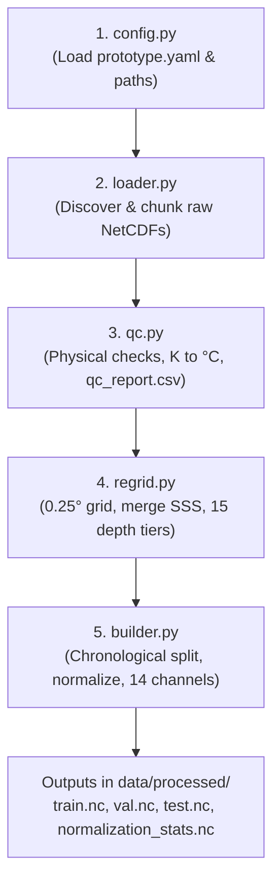

# ANTARBODH — Oceanographic Preprocessing Pipeline

This directory contains the production data preprocessing and harmonization pipeline for **ANTARBODH**, an AI-powered framework for subsurface ocean temperature reconstruction in the Bay of Bengal ($5^\circ\text{–}20^\circ\text{N}, 80^\circ\text{–}100^\circ\text{E}$).

---

## Quickstart

Run the end-to-end preprocessing pipeline directly from the repository root:

```bash
# Activate virtual environment
source .venv/bin/activate

# Execute pipeline
python -m src.preprocessing.pipeline
```

Or pass custom options:

```bash
python -m src.preprocessing.pipeline \
  --config configs/prototype.yaml \
  --raw-dir data/raw \
  --output-dir data/processed \
  --workers 4
```

---

## Module Architecture

| Module | Description |
| :--- | :--- |
| [`config.py`](config.py) | Configuration management and path resolution with fallback defaults. |
| [`loader.py`](loader.py) | Intelligent raw NetCDF discovery and chunk-optimized loading (Dask). |
| [`qc.py`](qc.py) | Physical bounds validation (SST, SSS, SSH, currents, winds), unit standardization (Kelvin $\to$ Celsius), and QC retention audit export. |
| [`regrid.py`](regrid.py) | Spatial interpolation to uniform $0.25^\circ$ grid, merging SSS ascending/descending passes, and GLORYS 3D vertical interpolation across 15 standard depths ($0\text{–}1000\,\text{m}$). |
| [`builder.py`](builder.py) | Chronological splitting, train-set normalization calculation, 14-channel assembly, and compressed NetCDF4 serialization. |
| [`pipeline.py`](pipeline.py) | Orchestration script with CLI arguments and progress logging. |

---

## Output Specifications

The pipeline serializes four core artifacts to `data/processed/`:

1. **`train.nc`** (2020–2023, 1,461 daily steps, ~314 MB compressed)
2. **`val.nc`** (2024, 366 daily steps, ~80 MB compressed)
3. **`test.nc`** (2025, 365 daily steps, ~74 MB compressed)
4. **`normalization_stats.nc`** (per-channel means and standard deviations computed strictly on the training partition)

### Tensor Representations

- **Input ($X$)**: Shape `(time, 14, 60, 80)` (float32)
  - **Channels 0–6 (Normalized Physical Variables)**:
    - `0: SST` — Sea Surface Temperature ($^\circ\text{C}$)
    - `1: SSS` — Combined Sea Surface Salinity ($\text{psu}$)
    - `2: SSH` — Sea Level Anomaly ($\text{m}$)
    - `3: Current_U` — Eastward surface current velocity ($\text{m/s}$)
    - `4: Current_V` — Northward surface current velocity ($\text{m/s}$)
    - `5: Wind_U` — Eastward wind velocity ($\text{m/s}$)
    - `6: Wind_V` — Northward wind velocity ($\text{m/s}$)
  - **Channels 7–13 (Observation Availability Masks)**:
    - `7: SST_mask` ($1.0$ if observed, $0.0$ if missing/cloud-covered)
    - `8: SSS_mask`
    - `9: SSH_mask`
    - `10: Current_U_mask`
    - `11: Current_V_mask`
    - `12: Wind_U_mask`
    - `13: Wind_V_mask`

- **Target ($Y$)**: Shape `(time, 15, 60, 80)` (float32)
  - Subsurface temperature across 15 standard depth layers:
    `[0, 5, 10, 20, 30, 50, 75, 100, 125, 150, 200, 300, 500, 700, 1000]` meters.

- **Target Mask ($Y_{mask}$)**: Shape `(time, 15, 60, 80)` (int8)
  - Binary ocean valid point mask for masked loss computation (automatically masks land points and bathymetry cutoffs).

---

## Reproducibility & Integrity Guarantees

- **No Future Data Leakage**: Normalization mean and variance parameters are computed strictly from the `train` partition ($t \le 2023$) and broadcast to `val` and `test`.
- **Zero-filled Inputs with Explicit Masks**: Missing sensor passes are zero-filled post-normalization, guaranteeing `X NaNs = 0` while preserving missingness signals in the mask channels.
- **Dask Parallel I/O**: Multi-threaded scheduler maximizes local CPU core utilization while maintaining safe memory bounds on large files.


You don't need to run each file manually one-by-one—**[`pipeline.py`](file:///Volumes/SAM-T7/SIH/Antarbodh-demo/src/preprocessing/pipeline.py) is the single master orchestrator** that automatically runs everything in the exact required sequence!

---

### The 1-Command Execution (Recommended)

From the root of the repository:

```bash
# Activate environment
source .venv/bin/activate

# Run the complete pipeline
python -m src.preprocessing.pipeline
```

*(Or directly via `python src/preprocessing/pipeline.py`)*

This single command coordinates all modules from start to finish and produces `train.nc`, `val.nc`, `test.nc`, and `normalization_stats.nc` in `data/processed/`.

---

### The Internal Execution Order

If you are running the steps programmatically in a Python script or notebook, here is the exact chronological sequence of the modules:



#### Detailed Breakdown of Each Step:

1. **[`config.py`](file:///Volumes/SAM-T7/SIH/Antarbodh-demo/src/preprocessing/config.py)**:
   - Reads [`configs/prototype.yaml`](file:///Volumes/SAM-T7/SIH/Antarbodh-demo/configs/prototype.yaml).
   - Sets spatial limits ($5^\circ\text{–}20^\circ\text{N}$, $80^\circ\text{–}100^\circ\text{E}$), target resolution ($0.25^\circ$), and 15 target depth levels.
   ```python
   from src.preprocessing.config import load_preprocessing_config
   cfg = load_preprocessing_config()
   ```

2. **[`loader.py`](file:///Volumes/SAM-T7/SIH/Antarbodh-demo/src/preprocessing/loader.py)**:
   - Discovers the raw NetCDF files in `data/raw/` (handles naming variations like `glorys_bob_(2).nc` automatically).
   - Opens them with tuned Dask chunk topologies (`time: 30`, `lat: 60`, `lon: 80`).
   ```python
   from src.preprocessing.loader import load_raw_datasets
   raw_datasets = load_raw_datasets(cfg.raw_dir)
   ```

3. **[`qc.py`](file:///Volumes/SAM-T7/SIH/Antarbodh-demo/src/preprocessing/qc.py)**:
   - Validates physical bounds (e.g., SST in $[-2, 40]^\circ\text{C}$, SSS in $[0, 38]\,\text{psu}$).
   - Converts SST from Kelvin to Celsius (`sst - 273.15`).
   - Exports the quality control audit to [`outputs/qc_report.csv`](file:///Volumes/SAM-T7/SIH/Antarbodh-demo/outputs/qc_report.csv).
   ```python
   from src.preprocessing.qc import apply_quality_control
   qc_vars = apply_quality_control(raw_datasets, cfg.outputs_dir)
   ```

4. **[`regrid.py`](file:///Volumes/SAM-T7/SIH/Antarbodh-demo/src/preprocessing/regrid.py)**:
   - Interpolates all 7 surface variables onto the unified $0.25^\circ$ grid.
   - Combines ascending and descending SSS observations.
   - Interpolates 3D GLORYS temperature vertically to the 15 standard depth levels and horizontally to the common grid.
   ```python
   from src.preprocessing.regrid import build_common_grid, regrid_surface_variables, regrid_glorys_target
   common_lat, common_lon = build_common_grid(cfg.min_lat, cfg.max_lat, cfg.min_lon, cfg.max_lon)
   surface_common = regrid_surface_variables(qc_vars, common_lat, common_lon)
   thetao_common = regrid_glorys_target(qc_vars["glorys"], cfg.target_depths, common_lat, common_lon)
   ```

5. **[`builder.py`](file:///Volumes/SAM-T7/SIH/Antarbodh-demo/src/preprocessing/builder.py)**:
   - Partitions data chronologically: **Train** ($\le 2023$), **Val** ($2024$), **Test** ($2025$).
   - Calculates mean and std **strictly on the Train split** to prevent data leakage.
   - Normalizes input features, zero-fills unobserved values, and stacks the 7 observation masks to create the **14-channel input tensor ($X$)**.
   - Aligns with target subsurface temperature ($Y$) and ocean mask ($Y_{mask}$).
   - Serializes compressed NetCDF4 files to `data/processed/`.
   ```python
   from src.preprocessing.builder import build_and_save_ml_datasets
   train_ds, val_ds, test_ds, norm_stats = build_and_save_ml_datasets(
       surface_common, thetao_common, cfg.processed_dir
   )
   ```